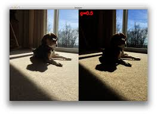

# Gamma-Corrected-Video-Generation
When there is some challenge to overcome where it is the matter of brightness,luminosity then gamma correction works best among all pre-processing.To reproduce a good dataset over a less luminous dataset it may help.

Gamma correction is mainly increment or decrement in gamma of an image 

# Installation
1. Clone this repository

2. Install dependencies
(OpenCV 3.4.3. or above,numpy and other basic dependencies which is usually used)
If you need help you can check (https://jeanvitor.com/cpp-opencv-windonws10-installing/)
Numpy and os is necessary.

# How to Generate:
All the folders and subfolders should be kept like the format given in noob folder.You can name this folder whatever you want or you may have one.Then you have to run the program(It is necessary to change name of folder at line 32,33 as your folder name).
You can see the output folder as name of 'Gamma_corrected'(You can change output folder name at line 35) where gamma corrected version video will be generated.  

Gamma also can be reduced if you put input parameter at line 75 less than 1.Gamma parameter = 0 will reproduce same luminous video.

For details :
https://www.pyimagesearch.com/2015/10/05/opencv-gamma-correction/
